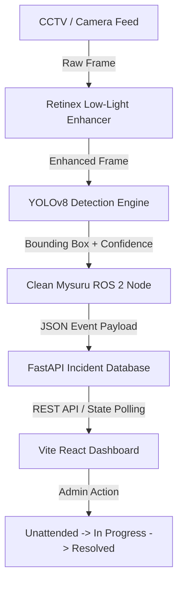

# 🏗️ Clean Mysuru Architecture & System Design

## 1. System Overview

**Clean Mysuru** is an autonomous civic governance system that processes city camera streams (or mobile citizen reports), enhances night-time low-light frames using Multiscale Retinex vision algorithms, detects civic anomalies (garbage overflow, potholes, clogged drains), and routes actionable incidents to municipal authorities via an interactive React web dashboard.

---

## 2. Technical Stack Rationale

| Subsystem | Technology | Rationale |
|---|---|---|
| **Edge Vision Engine** | ROS 2 (Humble) + OpenCV + YOLOv8 | Modular node architecture for low-latency video stream processing and real-time pub-sub detection messaging. |
| **Backend API** | FastAPI / Python REST Server | Lightweight async HTTP framework for high-throughput detection query serving and status mutations. |
| **Web Dashboard** | React + Vite + Custom CSS Glassmorphism | Fast, flicker-free rendering with tabbed operational views and interactive GIS map overlays. |
| **System Orchestration** | Shell script (`./start_all.sh`) | Single entry-point execution for starting vision ROS 2 nodes, server API, and Vite web UI concurrently. |

---

## 3. Data Flow Architecture

